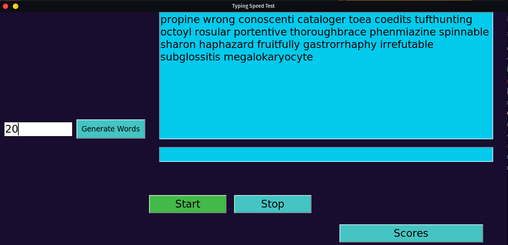

# Typing Speed Test

The Typing Speed Test is a simple and interactive application that allows users to measure their typing speed and accuracy. It presents users with a random set of words that they need to type as quickly and accurately as possible. The application calculates the typing speed in words per minute (WPM) and provides real-time feedback on the user's performance.


## Features

- Random word generation: Each typing test generates a unique set of words, ensuring a fresh and challenging experience every time.
- Input validation: The user's input is compared to the expected text to ensure accuracy. Errors are visually highlighted in the input field.
- Timer: The application tracks the time taken by the user to complete the typing test, providing an accurate measure of speed.
- Results tracking: Test scores are saved in a scores.txt file, allowing users to keep a record of their performance over time.
- User-friendly interface: The application offers a clean and intuitive interface built with Tkinter, making it easy for users to navigate and interact with the test.

## Getting Started

### Prerequisites

- Python 3.x

### Installation

1. Clone the repository:

   ```shell
   git clone https://github.com/your-username/typing-speed-test.git
   ```

2. Navigate to the project directory:

   ```shell
   cd typing-speed-test
   ```

3. Install the required dependencies:

   ```shell
   pip install -r requirements.txt
   ```

### Usage

1. Run the application:

   ```shell
   python typing_speed_test.py
   ```

2. Specify the number of words you want to type and click the "Generate Words" button.
3. The application will display a set of words for you to type.
4. Start typing in the input field.
5. Errors will be visually highlighted in the input field, helping you identify and correct mistakes.
6. Once you have finished typing all the words correctly, the application will provide your typing speed in WPM.
7. Click the "Scores" button to view your previous test scores and track your progress over time.

## License

This project is licensed under the [MIT License](LICENSE).

## Acknowledgements

- [Nerd Fonts](https://www.nerdfonts.com/) - Used for the application's font.
- [Words Alpha](https://github.com/dwyl/english-words) - Used as the word source for generating random words.

## Contributing

Contributions are welcome! If you have any ideas, suggestions, or improvements, please open an issue or submit a pull request.

## Contact

For any inquiries or feedback, please contact [your-email@example.com](mailto:your-email@example.com).

Enjoy testing your typing speed and improving your skills with the Typing Speed Test application!
```

Make sure to replace `your-username` in the clone command with your actual GitHub username and update the contact email as well. You can also customize the screenshot image by replacing `screenshot.png` with an actual screenshot of your application.

This revised README.md provides a more detailed and visually appealing overview of your Typing Speed Test project on GitHub. Feel free to further modify it to meet your project's specific needs.

Good luck with your project!